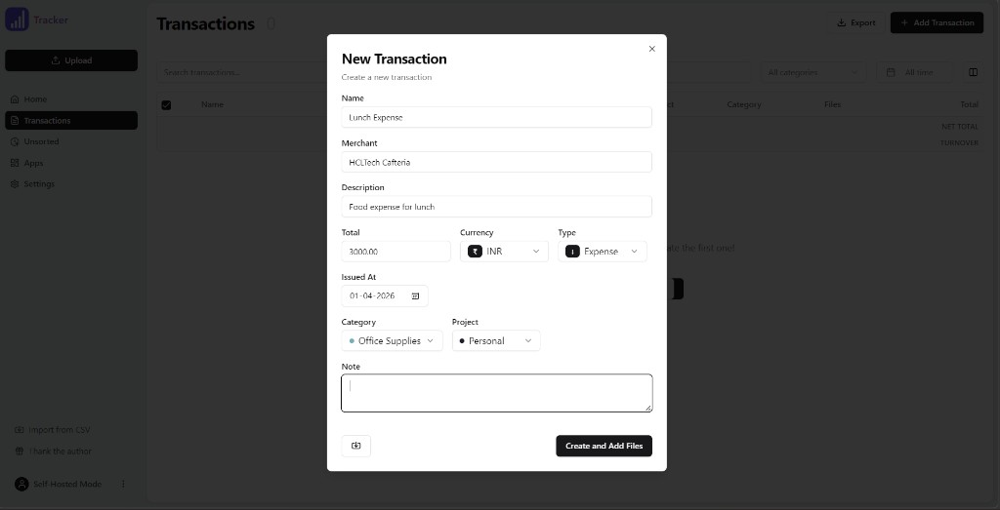
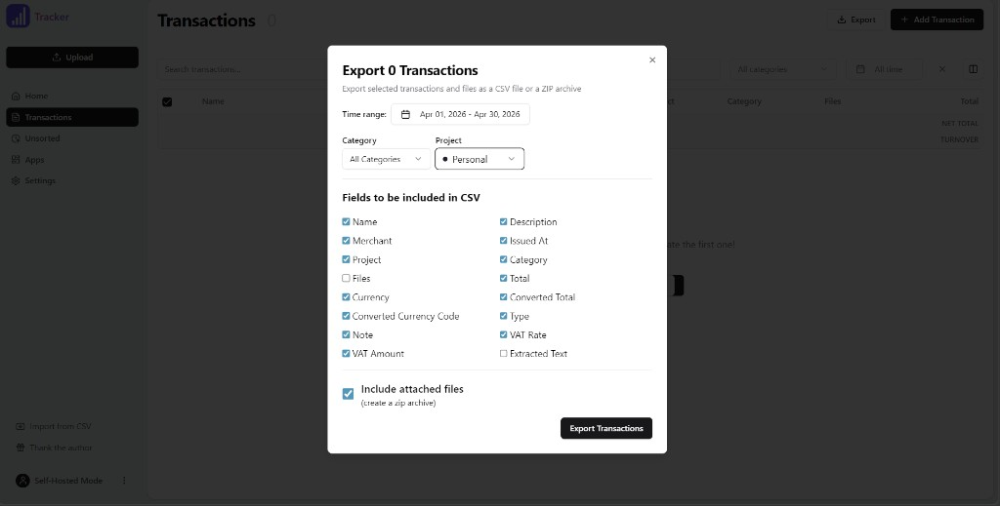

# Ledger — self-hosted AI accounting

**Ledger** is a self-hosted web app for tracking receipts, invoices, and expenses. You keep your data on your own server (PostgreSQL); optional LLM providers read documents and help structure entries—you control the prompts and API keys.

## What it helps with

- **Capture spending and income** — Add transactions by hand or by uploading photos and PDFs. AI can extract amounts, dates, merchants, line items, and notes so you spend less time on data entry.
- **Stay organized** — Use **categories** and **projects** to group transactions, search and filter by time range, and show the columns you care about in the table.
- **Match how you work** — Define **custom fields** and tune **LLM prompts** in settings so extraction and categorization follow your labels, tax lines, or internal codes. Custom fields can flow into **CSV exports** for your accountant or spreadsheets.
- **Multiple currencies** — Store amounts in the original currency with conversion to a default currency, using rates for the transaction date (including many fiat and common crypto pairs).
- **Move data in and out** — **Import** transactions from CSV; **export** filtered data as CSV and optionally bundle attached files in a **ZIP** for backups or handoff.
- **Invoices** — Use the built-in **invoice generator** to produce PDFs (with tax-inclusive or tax-exclusive line items), save templates, and record invoices as transactions when needed.
- **Unsorted uploads** — Drop files into the queue, review AI results, then attach them to or create transactions when you are ready.

Ledger is aimed at freelancers, small teams, and anyone who wants a private ledger with AI-assisted document handling—not a substitute for professional tax or legal advice.

## Screenshots

Transactions view with the **New Transaction** dialog: name, merchant, amount, currency, type, category, project, and file attachments.



**Export** — filter by time range, category, and project; pick CSV columns; optionally bundle attached files in a ZIP.



## Deploy with Docker

```bash
docker compose up --build -d
```

Open [http://localhost:7331](http://localhost:7331).

Set a strong `BETTER_AUTH_SECRET` in `docker-compose.yml` before production. Data: `./data` (uploads), `./pgdata` (PostgreSQL).

## Environment

| Variable | Required | Description |
| -------- | -------- | ----------- |
| `UPLOAD_PATH` | Yes | Upload directory |
| `DATABASE_URL` | Yes | PostgreSQL URL |
| `BETTER_AUTH_SECRET` | Yes | Auth secret (32+ characters recommended) |
| `SELF_HOSTED_MODE` | No | `true` for self-hosted |

See `.env.example` for LLM keys and other options.

## Local development

```bash
npm install
cp .env.example .env
npx prisma generate && npx prisma migrate dev
npm run dev
```

